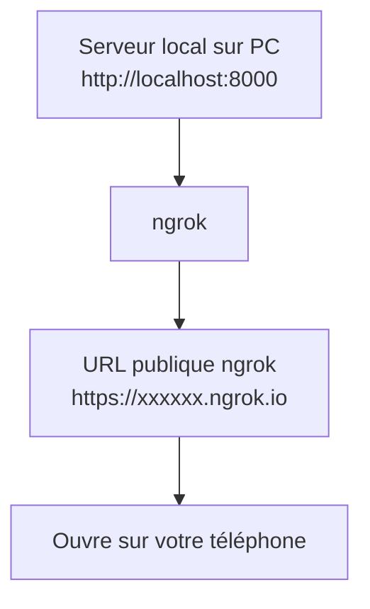

# Tester votre app HTML sur mobile avec ngrok

Ce guide vous explique comment prévisualiser et tester votre application HTML (PWA) sur votre téléphone, même si elle est hébergée localement sur votre ordinateur.

---

## 1. Lancer un serveur local

Ouvrez un terminal dans le dossier de votre projet (là où se trouve `reservation.html`).

### Avec Python (recommandé)

```sh
python -m http.server 8000
```

Votre page sera accessible sur :
```
http://localhost:8000/reservation.html
```

---

## 2. Lancer ngrok sur le même port

Dans un **autre terminal**, lancez :

```sh
ngrok http 8000
```

ngrok va générer une URL publique du type :
```
https://xxxxxx.ngrok.io
```

---

## 3. Ouvrir l'URL sur votre téléphone

- Ouvrez le navigateur de votre téléphone.
- Entrez l'URL fournie par ngrok, par exemple :
  - `https://xxxxxx.ngrok.io/reservation.html`
- Vous pouvez maintenant prévisualiser et utiliser votre app sur mobile !

---

## 4. Installer l'app sur votre téléphone (PWA)

- Ouvrez l'URL ngrok dans Chrome (Android) ou Safari (iOS).
- Cliquez sur le menu (⋮ ou partager).
- Choisissez **« Ajouter à l'écran d'accueil »**.
- Lancez l'app depuis l'icône : elle sera en plein écran, comme une vraie app.

---

## Schéma récapitulatif



---

## Remarques
- Votre ordinateur doit rester allumé et connecté à Internet.
- Si vous modifiez le HTML ou le CSS, rechargez la page sur votre téléphone pour voir les changements.
- Si vous avez besoin d'aide pour installer ngrok ou Python, demandez ! 